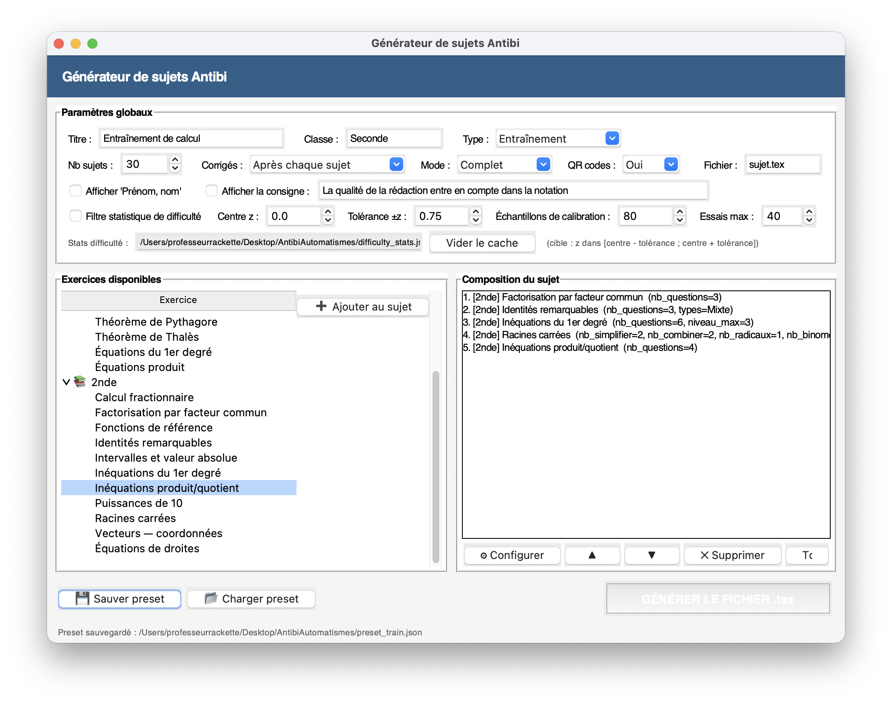

# AntibiAutomatismes

[](LICENSE)

Générateur de sujets de mathématiques inspiré de la méthode d’André Antibi.

Le projet a pour but de produire des feuilles d’entraînement et des évaluations composées d’exercices **proches de ceux déjà travaillés en classe**, avec une **structure familière** mais des **données différentes** selon les versions générées.

L’idée générale est simple : automatiser la préparation de sujets sans perdre de vue la logique pédagogique.  
L’élève doit être évalué sur des techniques réellement entraînées, et non sur des variations artificiellement déstabilisantes.


## Aperçu



---

## Idée pédagogique

AntibiAutomatismes s’inscrit dans l’esprit de l’**évaluation par contrat de confiance (EPCC)** défendue par André Antibi :

- la phase d’apprentissage et la phase d’évaluation sont clairement distinguées ;
- les exercices du contrôle restent proches de ceux travaillés à l’entraînement ;
- on cherche à éviter l’évaluation-piège ;
- la difficulté peut être pilotée pour garder des sujets comparables.

Le projet ne se contente donc pas de générer des exercices aléatoires : il cherche à produire des sujets **utilisables en classe**, dans une logique de cohérence pédagogique.

---

## Ce que fait le projet

L’application permet de :

- composer un sujet à partir d’un catalogue d’exercices ;
- configurer chaque exercice individuellement ;
- générer plusieurs versions d’un même sujet ;
- produire un fichier LaTeX `.tex` prêt à compiler ;
- inclure des corrigés complets ou succincts ;
- inclure des QR codes de réponses ;
- sauvegarder et recharger des compositions au format JSON ;
- calibrer partiellement la difficulté à l’aide de statistiques enregistrées.

---

## Public visé

Le projet s’adresse principalement à des enseignants de mathématiques souhaitant :

- préparer rapidement des entraînements et des contrôles ;
- générer plusieurs variantes d’un même devoir ;
- rester dans l’esprit de la méthode Antibi ;
- conserver une difficulté globalement cohérente entre plusieurs sujets ;
- automatiser la production de documents LaTeX.

---

## État actuel du projet

Le projet est déjà **fonctionnel** et permet de produire de vrais sujets.

Il comprend actuellement :

- une interface graphique Tkinter ;
- un registre de générateurs d’exercices ;
- une génération LaTeX structurée ;
- des presets JSON ;
- un système de calibration/statistiques de difficulté ;
- un dossier `Exemples/` avec des documents de démonstration.

Le dépôt est donc déjà exploitable, même s’il reste perfectible.

---

## Démarrage rapide

### 1. Installer la dépendance Python minimale

```bash
pip install sympy
```

### 2. Lancer l’application

```bash
python main.py
```

### 3. Générer un sujet

Depuis l’interface :

1. choisir un titre, une classe et un type de document ;
2. ajouter des exercices depuis le catalogue ;
3. configurer les exercices ;
4. générer le fichier `sujet.tex`.

### 4. Compiler le document

```bash
xelatex sujet.tex
```

En quelques minutes, on peut ainsi produire un premier sujet PDF.

---

## Structure du dépôt

### Fichiers principaux

- `main.py` : interface graphique et orchestration générale ;
- `generators.py` : catalogue et logique de génération des exercices ;
- `latex_builder.py` : assemblage du document LaTeX final.

### Fichiers de configuration et de données

- `preset.json` : exemple de composition sauvegardée ;
- `preset_train.json` : preset orienté entraînement ;
- `difficulty_stats.json` : statistiques utilisées pour la calibration de difficulté.

### Dossier d’exemples

- `Exemples/` : exemples de sorties ou de documents associés au projet.

---

## Niveaux et types d’exercices

Le catalogue couvre actuellement plusieurs niveaux du collège et du lycée, avec notamment des exercices de :

### 5e
- calcul sur les relatifs ;
- priorités opératoires ;
- distributivité simple.

### 3e
- réduction d’expressions ;
- développement ;
- équations du premier degré ;
- équations produit ;
- théorèmes de Pythagore et de Thalès.

### 2nde
- puissances de 10 ;
- inéquations du premier degré ;
- calcul fractionnaire ;
- racines carrées ;
- coordonnées de vecteurs ;
- équations de droites ;
- inéquations produit / quotient ;
- intervalles ;
- valeur absolue ;
- fonctions de référence.

Le catalogue a vocation à continuer à s’enrichir.

---

## Fonctionnement général

L’application propose une interface Tkinter dans laquelle on peut :

1. choisir les paramètres globaux du document ;
2. sélectionner les exercices dans un catalogue classé par niveau ;
3. configurer chaque exercice ;
4. organiser la composition du sujet ;
5. choisir les options de corrigé ;
6. générer le fichier `.tex` final.

Le document obtenu peut ensuite être compilé en PDF avec XeLaTeX.

---

## Installation

### Prérequis Python

- Python 3.8 ou plus récent ;
- `sympy` ;
- `tkinter` (souvent déjà inclus selon la distribution Python et le système).

---

## Compilation LaTeX

Le programme génère un fichier `sujet.tex`.

Compilation recommandée :

```bash
xelatex sujet.tex
```

Packages LaTeX utilisés par le projet :

- `amsmath`
- `lmodern`
- `babel`
- `geometry`
- `pgf`
- `tikz`
- `tkz-tab`
- `fancyhdr`
- `qrcode`
- `enumitem`
- `datetime2`

---

## Presets et personnalisation

Les compositions peuvent être sauvegardées puis rechargées au format JSON.

Cela permet par exemple de :

- réutiliser une structure de devoir d’une année sur l’autre ;
- préparer plusieurs variantes d’un même chapitre ;
- distinguer facilement des presets d’entraînement et d’évaluation.

---

## Gestion de la difficulté

Le projet inclut un mécanisme de calibration fondé sur des statistiques de difficulté.

L’objectif n’est pas de produire une mesure parfaite, mais d’aider à :

- rapprocher plusieurs sujets d’un même niveau global ;
- éviter des écarts trop importants entre variantes ;
- conserver une meilleure homogénéité d’ensemble.

---

## Exemples

Le dépôt contient un dossier `Exemples/` destiné à montrer le type de documents générés par le projet.

Il peut servir de point d’entrée rapide pour comprendre le rendu concret avant même de lancer l’application.

---

## Ajouter un nouvel exercice

L’architecture du projet repose sur un registre de générateurs dans `generators.py`.

L’ajout d’un nouvel exercice suit l’idée générale suivante :

- définir une nouvelle classe de générateur ;
- lui donner un identifiant, un nom, un niveau et une description ;
- définir les paramètres configurables ;
- implémenter la génération de l’énoncé, du corrigé et des métadonnées utiles.

L’exercice devient alors intégrable dans l’interface et dans la composition des sujets.

---

## Philosophie du projet

AntibiAutomatismes ne cherche pas seulement à automatiser.

Le projet défend aussi une certaine manière de concevoir l’évaluation :

- entraîner sur des types d’exercices identifiés ;
- évaluer sur des tâches réellement préparées ;
- varier les données plutôt que changer subrepticement la nature des questions ;
- conserver une exigence mathématique sans transformer l’évaluation en piège.

---

## Limites et pistes d’amélioration

Le projet peut encore être amélioré sur plusieurs points :

- enrichissement du catalogue ;
- amélioration de la documentation ;
- meilleure formalisation des statistiques de difficulté ;
- ajout de tests automatiques ;
- amélioration de l’export et du flux de compilation ;
- ajout de captures d’écran ou d’exemples visuels plus complets dans le dépôt.

---

## Auteur

Projet personnel de génération de sujets de mathématiques.

---

## Licence

Le code source de ce projet est distribué sous licence MIT.

La documentation, le README et les contenus pédagogiques associés sont distribués sous licence Creative Commons Attribution 4.0 International (CC BY 4.0).
